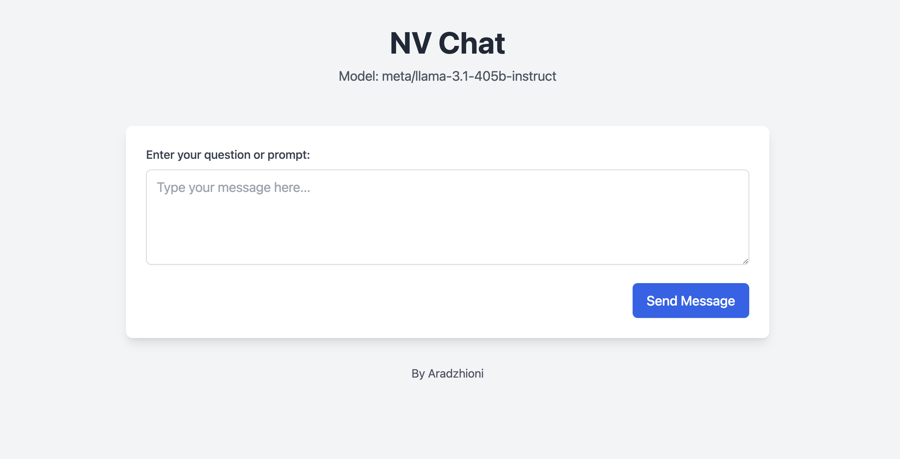

# NV Chat

A sleek web application that allows you to interact with NVIDIA's AI models through their OpenAI-compatible API. This application provides a modern, user-friendly interface for conversing with the meta/llama-3.1-405b-instruct model.



## Prerequisites

Before you begin, ensure you have the following installed:

1. **Python 3.8 or higher**
   - Check your Python version:
     ```bash
     python --version
     ```
   - If not installed, download from [Python's official website](https://www.python.org/downloads/)

2. **Git** (for cloning the repository)
   - Check if Git is installed:
     ```bash
     git --version
     ```
   - If not installed, download from [Git's official website](https://git-scm.com/downloads)

3. **NVIDIA API Key**
   - Sign up at [NVIDIA AI Foundation Models](https://www.nvidia.com/en-us/ai-data-science/foundation-models/)
   - Navigate to API Keys section
   - Generate a new API key
   - Keep this key secure - you'll need it later!

## Installation Guide

1. **Clone the Repository**
   ```bash
   git clone https://github.com/aradzhioni/nv-chat.git
   cd nv-chat
   ```

2. **Set Up Python Virtual Environment**
   
   On macOS/Linux:
   ```bash
   python -m venv venv
   source venv/bin/activate
   ```
   
   On Windows:
   ```bash
   python -m venv venv
   .\venv\Scripts\activate
   ```

3. **Install Required Packages**
   ```bash
   pip install -r requirements.txt
   ```

4. **Set Up the Application File**
   ```bash
   # Copy the template file to create your local app file
   cp app_template.py app.py
   ```

5. **Configure Your API Key**
   
   Open `app.py` and replace the API key placeholder with your own:
   ```python
   API_KEY = "your-nvidia-api-key-here"
   ```
   
   **Security Note**: For production use, consider using environment variables:
   ```bash
   # On macOS/Linux
   export NVIDIA_API_KEY="your-api-key-here"
   
   # On Windows (Command Prompt)
   set NVIDIA_API_KEY=your-api-key-here
   
   # On Windows (PowerShell)
   $env:NVIDIA_API_KEY="your-api-key-here"
   ```

## Running the Application

1. **Start the Flask Server**
   ```bash
   python app.py
   ```

2. **Access the Application**
   - Open your web browser
   - Navigate to: `http://localhost:8080`
   - You should see the NV Chat interface

## Usage Guide

1. **Starting a Conversation**
   - Type your question or prompt in the text area
   - Click "Send Message" or press Enter
   - Wait for the AI to respond (you'll see a loading indicator)

2. **Best Practices**
   - Be specific with your questions
   - Keep prompts clear and concise
   - Wait for the complete response before sending another message

3. **Troubleshooting**
   - If you see an error message, check your API key
   - Ensure you have an active internet connection
   - Verify that the NVIDIA API service is available

## Technical Details

- **Frontend**: HTML5, Tailwind CSS, JavaScript
- **Backend**: Python 3.x, Flask
- **API**: NVIDIA AI Foundation Models (OpenAI-compatible endpoint)
- **Dependencies**:
  - Flask: Web framework
  - OpenAI: API client library
  - Requests: HTTP library
  - Additional dependencies listed in `requirements.txt`

## Project Structure
```
nv-chat/
├── app.py              # Main Flask application
├── app_template.py     # Template for the application file
├── requirements.txt    # Python dependencies
├── static/
│   └── script.js      # Frontend JavaScript
└── templates/
    └── index.html     # HTML template
```

## Common Issues & Solutions

1. **Port 8080 Already in Use**
   ```bash
   # Find the process using port 8080
   lsof -i :8080
   
   # Kill the process
   kill -9 [PID]
   ```

2. **API Key Issues**
   - Verify your API key is correct
   - Check if your API key has sufficient credits
   - Ensure the key is properly set in the application

3. **Virtual Environment Problems**
   ```bash
   # If venv creation fails, try:
   python -m pip install --upgrade pip
   python -m pip install virtualenv
   ```

## Contributing

1. Fork the repository
2. Create your feature branch
   ```bash
   git checkout -b feature/AmazingFeature
   ```
3. Commit your changes
   ```bash
   git commit -m 'Add some AmazingFeature'
   ```
4. Push to the branch
   ```bash
   git push origin feature/AmazingFeature
   ```
5. Open a Pull Request

## Security Considerations

- Never commit your API key to version control
- Use environment variables for sensitive data
- Keep your dependencies updated
- Use HTTPS in production
- Implement rate limiting for production use

## License

This project is licensed under the MIT License - see the [LICENSE](LICENSE) file for details.

## Author

**Aradzhioni**
- GitHub: [@aradzhioni](https://github.com/aradzhioni)

## Acknowledgments

- NVIDIA AI Foundation Models team
- Flask framework developers
- Tailwind CSS team
- OpenAI for the client library interface

---

For issues, feature requests, or questions, please open an issue on GitHub.
